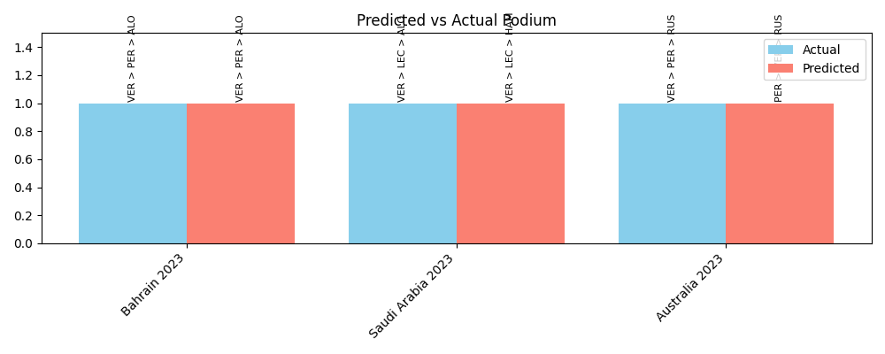

# 🏎️ F1 Race Predictor - Predicting the Top 3 Finishers with Machine Learning

This project aims to **predict the top 3 podium finishers** in Formula 1 races using machine learning and historical race data from the [FastF1 API](https://theoehrly.github.io/Fast-F1/). 

It includes:
- Data collection from F1 sessions
- Feature engineering from lap and race metrics
- Training models (Logistic Regression, Random Forest, XGBoost)
- Evaluating predictions and visualizing outcomes


## Project Overview

This project builds a machine learning pipeline to predict the Top 3 finishers (podium positions) in Formula 1 races using real-time and historical data from the FastF1 API. It includes data collection, preprocessing, feature engineering, model training, and evaluation using both metrics and visualizations.

---

## Problem Statement

Formula 1 outcomes depend on many variables: driver skill, team performance, qualifying results, tyre strategy, and track conditions.

Can we use machine learning to accurately predict the top 3 finishers in a race using structured race data?

---

## Data Description & Preparation

The data used in this project is sourced from the **[FastF1 API](https://theoehrly.github.io/Fast-F1/)**, which provides detailed telemetry and timing data for every Formula 1 session.

## Data Includes:
- Driver name, team, car number
- Lap times, sector times
- Qualifying position
- Pit stops and stint data
- Weather and track status
- Final race position

## Preprocessing Steps:
- Loaded qualifying and race data for each selected Grand Prix
- Removed drivers who did not complete the race or had incomplete lap data
- Converted lap times and speeds into numerical features
- Merged session data into a combined dataset per race

## Engineered Features:
- `position_gain`: difference between starting and finishing position
- `avg_lap_time`: average lap time for each driver
- `pit_stop_count`: number of pit stops
- `qualifying_position`: grid start position
- `laps_completed`: number of laps completed
- `stint_length`: average stint duration between pit stops

## Approach

- **Data Extraction** from FastF1 API  
- **Feature Engineering**: qualifying position, tyre compound, constructor points, average lap times  
- **Modeling**: Logistic Regression, Random Forest, XGBoost  
- **Evaluation**: accuracy score, podium hit rate, confusion matrix  
- **Visualization**: feature importance and predicted vs actual podium comparison  

---

## Key Results

- **Random Forest** achieved approximately **65% accuracy** in predicting podium finishes  
- **Top features** influencing predictions:
  - **Qualifying Position**
  - **Constructor Points**
  - **Tyre Strategy**
- Visualizations helped highlight the strengths and weaknesses of the model  

---

## Feature Importance

To understand the model’s behavior, we analyzed feature importance scores using Random Forest.  

- Qualifying Position had the most impact — better grid positions often lead to better race finishes.  
- Constructor Points indicate team performance and reliability.  
- Tyre Strategy affects race pace and consistency.  

These findings align with real-world F1 race logic.

**Visual Output:** `visuals/feature_importance.png`

---

## Predicted vs Actual Podium

This chart compares the model's predicted top 3 drivers to the actual podium finishers across multiple races.

[](visuals/predicted_vs_actual_podium.png)


---

## How to Run

**1. Clone the Repository**
```bash
git clone https://github.com/lakshmiswetha-ba/F1RacePredictor.git
cd F1RacePredictor


**2. Install Dependencies**
```bash
pip install -r requirements.txt
```


**3. Train the Model**
```bash
python src/train_model.py
```

**4. View Outputs**
- Predictions: `outputs/predictions.csv`  
- Visualizations: `visuals/`

---

## Tech Stack

- **Python**
- **pandas**, **scikit-learn**, **matplotlib**, **XGBoost**
- **FastF1 API** 
- **VS Code, Git, GitHub** 

---

## Features

- Predicts Top 3 podium finishers using ML
- Analyzes feature importance
- Visualizes predicted vs actual podium
- Clean and modular codebase for easy extension

---

## Future Enhancements

- Expand dataset with more race seasons
- Build a Streamlit or Flask web app for interaction
- Add features like weather, pit strategy, and telemetry data

---

## Crafted By

**Lakshmi Swetha Bathula**  
[GitHub](https://github.com/lakshmiswetha-ba)  
[LinkedIn](https://www.linkedin.com/in/lakshmiswetha)

---

## What I Learned

- Built a complete ML workflow on real-world data  
- Explored F1 strategy and driver performance using data  
- Gained experience with model interpretability and visualization  
- Practiced technical storytelling through project documentation

---

This project is open to feedback.  
Feel free to fork it, raise issues, or connect!
